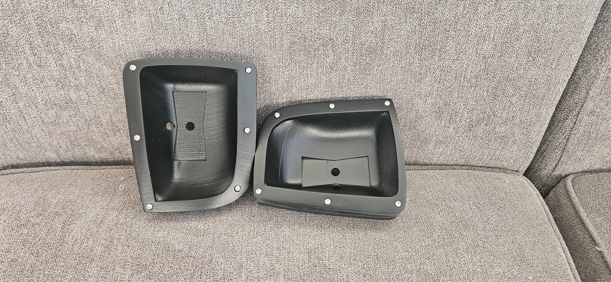
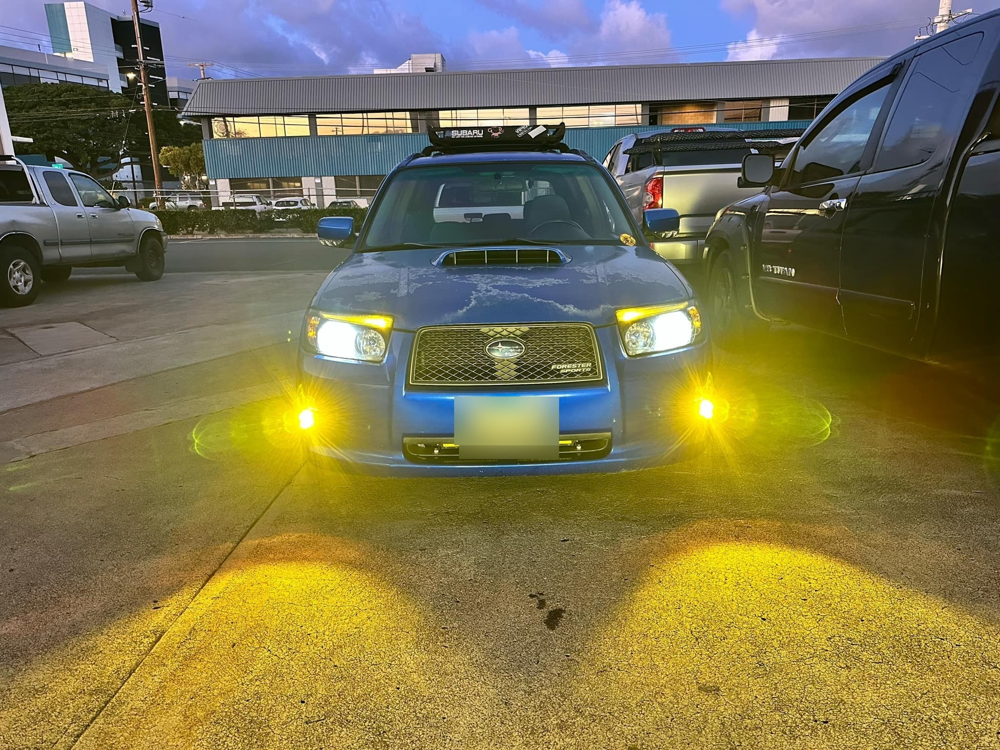
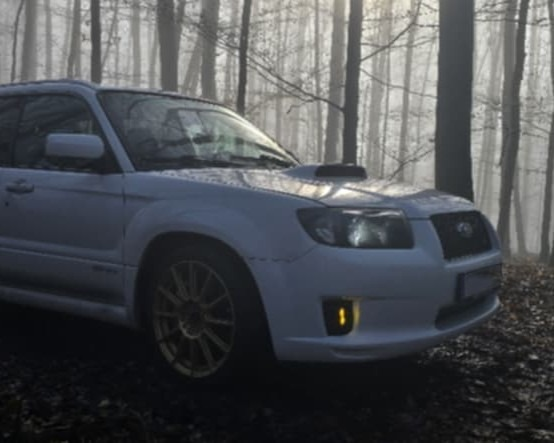
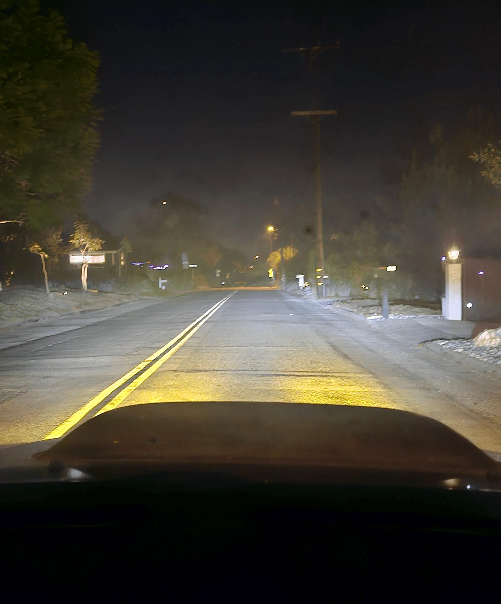

# SG Forester Amber Auxiliary Light Kit

**Plug-and-play amber auxiliary lights with a seamless, factory-like fit** for the
2006–2008 Subaru Forester Sports bumper (SG facelift). The only light housing
designed specifically for the Forester SG Sports model — it flush-mounts into the
factory fog light openings and wires into the car's own fog light circuit.

Designed, sold, and street-proven by SMITHTRONIC in 2024–2025 ($250 assembled /
$150 DIY). Now open source: print it, build it, remix it.

## Why it works

- **Perfect fit** — seamlessly integrates into the Sports bumper fog light holes;
  looks like it came from the factory.
- **Factory wiring** — uses the OEM fog light relay (82501AE03A) and dash switch
  (83001SA000); the harness is already in your car.
- **Adjustable beam** — vertical and horizontal articulation to aim the light
  exactly where you want it.
- **Bring your own light** — any light on a single through-bolt bracket up to
  64.5 × 23 mm fits; 3-inch amber spot pods fill the opening perfectly.
- **Durable build** — ASA plastic, brass heat-set inserts, and a retainer that
  clamps the housing against the back of the bumper (no threads in plastic
  carrying load).

| | | |
|---|---|---|
|  |  |  |

## What owners said

> "Made it look more like a factory option. Which it probably should have been for
> the 'sports' model." — **Chris**

> "The best fog light design for the SG9 sports bumper... I had to order another
> set for my automatic 07 FXT." — **Joe**

> "These lights give the car a new character, sharper and more futuristic. They
> blend beautifully too." — **Maks**

## Build one

| Guide | What's in it |
|---|---|
| [Print settings](docs/print-settings.md) | production ASA profiles, per-part layer heights, 45° orientation, supports |
| [Bill of materials](docs/bom.md) | printed parts, hardware, OEM part numbers, the exact lights/connectors/bolts production used |
| [Finishing](docs/finishing.md) | the production sand → high-build primer → satin black process |
| [Install guide](docs/install-guide.md) | illustrated 13-step install, wiring polarity, beam aiming, known quirks |

**Files:** print-ready STLs in [`models/stl/`](models/stl/) (verified watertight),
complete Bambu Studio projects with proven settings in [`models/3mf/`](models/3mf/),
and the CAD source in [`models/cad/`](models/cad/) — a **STEP** file that opens in any
CAD package (Fusion, SolidWorks, FreeCAD, Onshape) plus the original Fusion 360 archive.

**Want a different light?** The STEP is the real model, not a mesh — reshape the light
pocket around whatever you're mounting instead of being held to the 64.5 × 23 mm
bracket limit.

**Get it on Thingiverse:** [SMITHtRONiC](https://www.thingiverse.com/SMITHtRONiC)

## FAQ highlights (from the original product page)

**Why spot-style LEDs instead of flood?** The 3 × 1.5-inch light fills the opening
and flows with the vehicle's lines. Flood patterns only worked mounted
horizontally; spot pods stay vertical and tight to the body, and the housing's
articulation points the beam where the flood would have gone — just below the
headlight beam.

**Can I use a different light?** That's the point of the design — any light whose
bracket meets the size limits mounts with a single through-bolt. And now that the
Fusion source is public, you can remix the housing for anything else.

**Are these SAE approved?** The design makes no compliance claims — check your
local regulations for auxiliary lighting.

## License

[CC BY-NC-SA 4.0](LICENSE.md) — build it, remix it, share it with attribution.
**No commercial use.** Community photos in [`gallery/community/`](gallery/community/)
are used with their owners' permission and are **not** covered by the project
license — see [CREDITS](gallery/community/CREDITS.md).

Contact: ron@smithtronic.com · Product page and illustrated install guide:
[smithtronic.com](https://www.smithtronic.com/shop/auxlightkit/)
