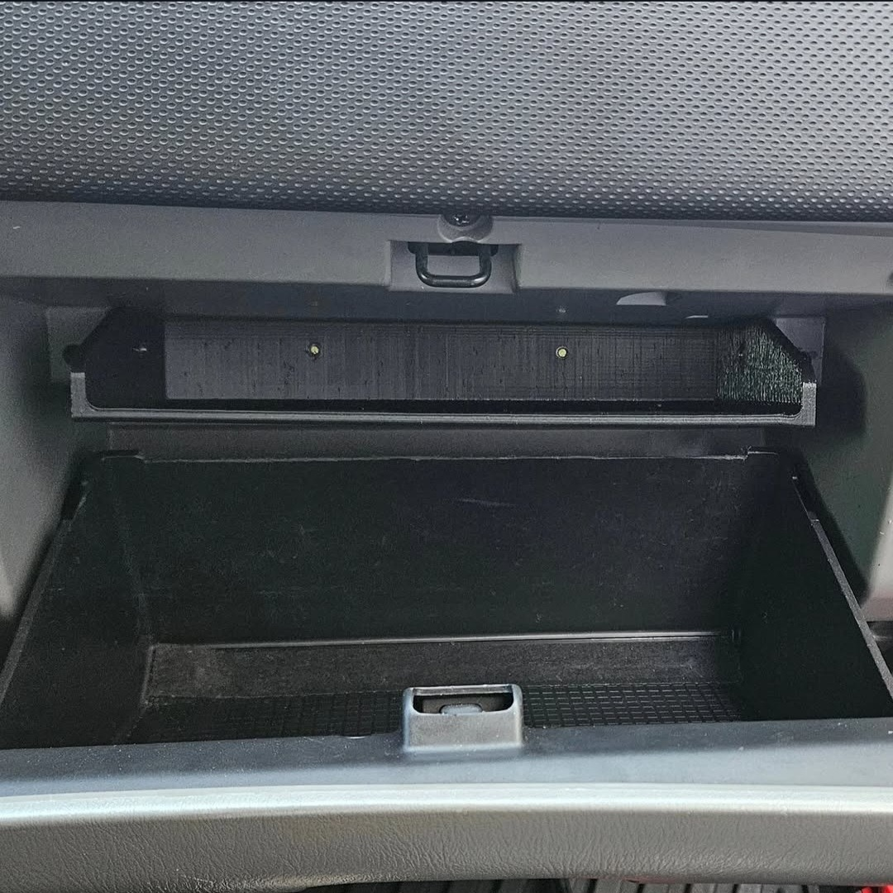

# Glove Box Shelf — 2006–2008 Subaru Forester (SG)

**The glove box organizer newer cars get from the factory.** The SG Forester's
glove compartment is one big unstructured bin, so the owner's manual and your
insurance/registration paperwork end up buried under everything else. This
one-piece shelf mounts high in the compartment, gives the documents a dedicated
flat home, and leaves the space below fully usable.

Designed and daily-driven by SMITHTRONIC. Now open source: print it, mount it,
remix it.

## Why it works

- **Factory look** — sits high and square in the compartment, printed in
  low-gloss black ASA that matches the interior.
- **Documents up top** — the owner's manual and paperwork lie flat and reachable;
  everything else lives underneath instead of on top of them.
- **One piece, four bolts** — no brackets, no adhesive; one bolt each side and
  two in the rear. The shelf prints solid — drill holes where your bolts suit
  (M5 is plenty), or model them into the included CAD first.
- **ASA construction** — dashboards bake in the sun; PLA would sag here.

## What's here

| Path | What it is |
|---|---|
| [`models/stl/glove_box_shelf.stl`](models/stl/glove_box_shelf.stl) | The shelf (271 × 133 × 45 mm), exact production geometry |
| [`models/3mf/shelf_ASA.3mf`](models/3mf/shelf_ASA.3mf) | Production Bambu Studio project — on-edge orientation, settings, and painted supports included |
| [`models/cad/`](models/cad/) | CAD source — STEP plus the native SolidWorks part |
| [`docs/print-settings.md`](docs/print-settings.md) | The production print profile, transcribed for any slicer |
| [`docs/install-guide.md`](docs/install-guide.md) | The (three-step) install |
| [`docs/bom.md`](docs/bom.md) | The (very short) bill of materials |
| [`thingiverse/`](thingiverse/) | The Thingiverse listing source and publish tooling |

## Print it

ASA recommended. The shelf is longer than a P1-series bed, so it prints
**standing on edge** — orientation and painted supports are already set up in the
project. 0.08 mm layers, 4 walls, 60 % Rectilinear infill, 10 mm brim. Full
details in [`docs/print-settings.md`](docs/print-settings.md).

## Install it

Three steps: test-fit high in the rear of the compartment, drill and fasten four
small bolts (one per side, two in the rear — the walls are thin plastic, so go
finger-tight), and load your documents flat on top. Details in
[`docs/install-guide.md`](docs/install-guide.md). This design may see future
revisions — it's the straightforward one of the bunch, on purpose.

**Fitment:** built and verified in a 2007 Forester XT; other SG-generation
Foresters are likely identical but unverified.

**Get it on Thingiverse:** [thing:7393048](https://www.thingiverse.com/thing:7393048)
— or browse everything by [SMITHtRONiC](https://www.thingiverse.com/SMITHtRONiC)

## License

[CC BY-NC-SA 4.0](LICENSE.md) — build it, remix it, share it with attribution;
no commercial use. If you print one,
[I'd like to see it](https://www.smithtronic.com/contact/).
