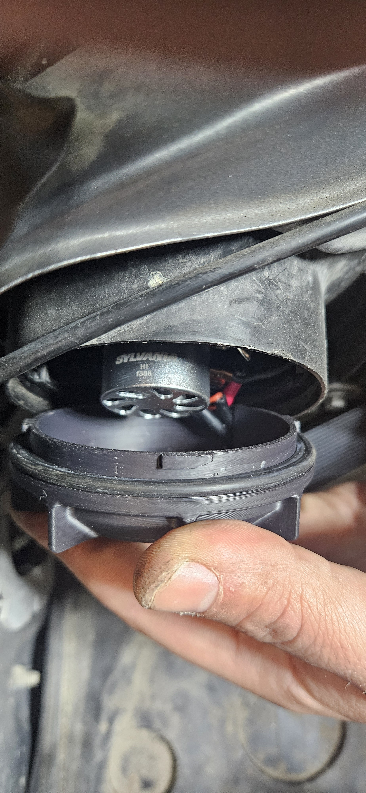
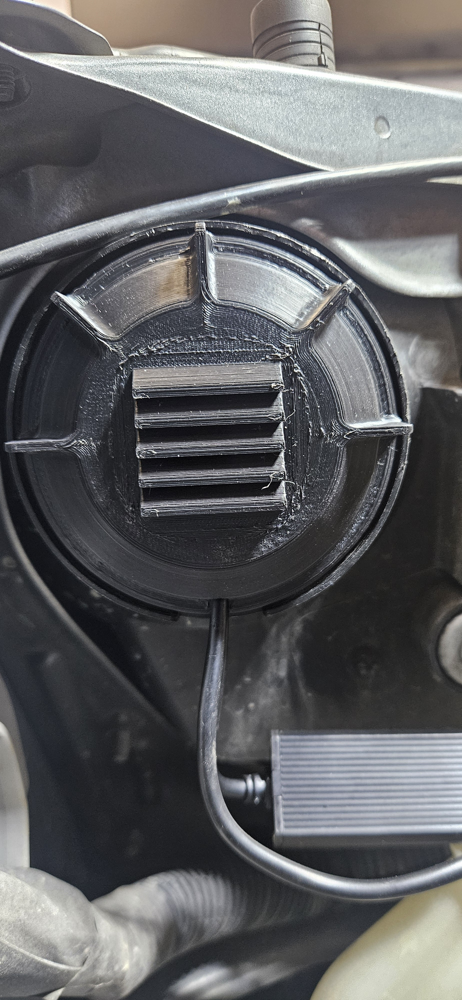

# Install guide — Vented Headlight Bulb Caps

**Fitment:** 2006–2008 Subaru Forester (SG facelift) headlight housings.
**You need:** the two printed caps ([print settings](print-settings.md)), your LED
bulbs with their voltage boxes, and the O-rings off your stock caps
([BOM](bom.md)). No tools beyond what it takes to reach the back of the housings.

## Steps

1. **Remove the stock headlight caps.** For access, you may need to remove the
   battery (driver's side) and the fender-mounted air intake baffle (passenger's
   side).
2. **Carefully remove the O-ring from your original caps.** It's the only part of
   the stock cap you keep using — don't nick it.
3. **Install your LED bulbs** according to the manufacturer's directions.
4. **Route the harness connector through the O-ring.**
5. **Guide the voltage box wire through the slot in the cap**, then loop it back
   through. The voltage box stays outside the cap — it won't fit inside the
   housing, and outside it sheds heat better anyway.
6. **Slip the O-ring over the printed cap.** It seats where the stock cap carried
   it.
7. **Lock the cap in.** Each cap has three locking tabs — one is larger so it only
   goes in one way. Line up the large tab, then twist the cap to lock it into the
   headlight housing.

## Why the louvers

LED bulbs with rear fans need airflow, and a sealed stock cap doesn't leave room
for the fan in the first place. The extended dome clears the fan; the louvers let
air move while angling **downward** so water sheds off instead of dripping in.

## Compatibility note

These caps are designed for aftermarket LED headlight bulbs. They improve
ventilation and clearance, but **full waterproofing is not guaranteed** — the
louvers are angled to shed water, not to seal against a pressure wash aimed at the
back of the housing. Check clearance for your specific bulb: the dome adds space
over stock, but oversized fan assemblies exist.
